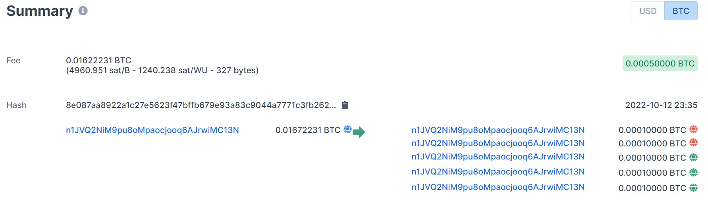
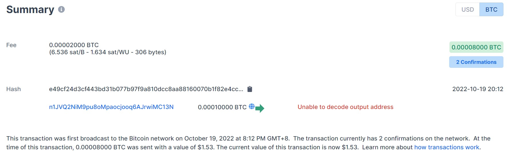
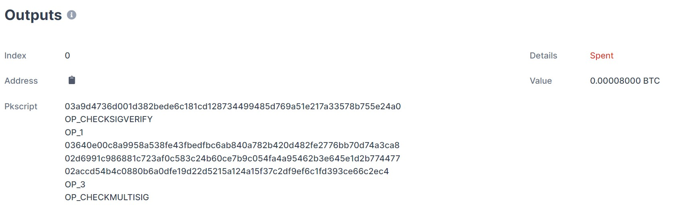
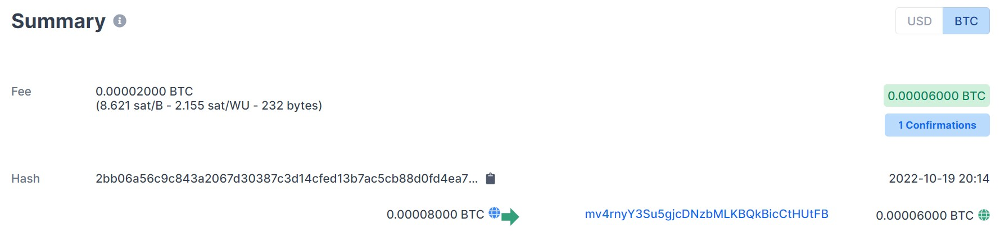

### <center>区块链实验报告</center>
 <p align="right">计算机科学与技术  &emsp;&emsp;  2012679王娇妹</p> 

#### ex2a.py
* 使用 keygen.py 生成三个客户的密钥，粘贴到ex2a.py中。
  
```python
# 三个客户的私钥和生成的公钥
cust1_private_key = CBitcoinSecret('cVZHPdsDGGd9Wmry1ZfM4vjY32v11GR6E4wsfSp2eWRGTWYZkLXn')
cust1_public_key = cust1_private_key.pub
cust2_private_key = CBitcoinSecret('cT6L7ZvQS9vW68psjxpHe4VBThbrjWFNpVR3Mhe969E5zR9LiNJ8')
cust2_public_key = cust2_private_key.pub
cust3_private_key = CBitcoinSecret('cVGGcfbchQ6aUmzq4NTHzjvnC7t6vmVovG1uU85rT8uuwiUr7d8u')
cust3_public_key = cust3_private_key.pub
 ```

* ex2a_txout_scriptPubKey
  我是银行，所以银行的私钥就是我的私钥，把 private key 填进去即可。
  对于一个涉及四方的多签名交易，这样交易可以由第一方（银行）与另外三方（客户） 中的任何一方（客户）共同赎回。所以需要在解锁时，必须要验证银行，而三个客户中验证一个即可。

    对于银行，要用OP_CHECKSIGVERIFY，对于客户，使用OP_CHECKMULTISIG。

 

 ```python
# 我（bank）的私钥
bank_private_key = CBitcoinSecret('cQvAwbiURvrbjaVHVyNMiyWQgUvHwMcdgTitsKvcJMYUZkNUZjnc')
# 我（bank）的公钥
bank_public_key = bank_private_key.pub

ex2a_txout_scriptPubKey = [bank_public_key, # 银行公钥
                            OP_CHECKSIGVERIFY,
                            OP_1,
                            cust1_public_key,# cust1公钥
                            cust2_public_key,# cust2公钥
                            cust3_public_key,# cust3公钥
                            OP_3,
                            OP_CHECKMULTISIG
                            ]
 ```
 * 参数的设置
  我使用的是实验一split_test_coins.py分割的比特币，在实验一中，我将0.0005的比特币分了5份。
  在实验一中我使用了第1份，这里我继续使用第2份，所以index为1。
 ```python
amount_to_send = 0.00008 # 平均每份0.0001，这里要略小于它
txid_to_spend = ('8e087aa8922a1c27e5623f47bffb679e93a83c9044a7771c3fb262769ade8333')
# 在ex1中，我把bitcoin分了5份，ex1用了第0份，现在用第1份
utxo_index = 1
  ```
* 输出

 ```json
 201 Created
{
  "tx": {
    "block_height": -1,
    "block_index": -1,
    "hash": "e49cf24d3cf443bd31b077b97f9a810dcc8aa88160070b1f82e4c07df1d267",
    "addresses": [
      "n1JVQ2NiM9pu8oMpaocjooq6AJrwiMC13N",
      "zFLCdon25wGxhcQS4ScPTz2F2htodGNUgx"
    ],
    "total": 8000,
    "fees": 2000,
    "size": 306,
    "vsize": 306,
    "preference": "low",
    "relayed_by": "2001:250:401:6571:f0cd:7bfa:757a:d86b",
    "received": "2022-10-19T12:12:28.514464828Z",
    "ver": 1,
    "double_spend": false,
    "vin_sz": 1,
    "vout_sz": 1,
    "confirmations": 0,
    "inputs": [
      {
        "prev_hash": "8e087aa8922a1c27e5623f47bffb679e93a83c9044a7771c3b262769ade8333",
        "output_index": 1,
        "script": "47304402206ab34339e0c9a0db26d6fe6b67bb55227cde8fd274619d0a1d93f31c53c4ef220220168b5216dfe1ab6633a9b0b12260ba4de79e16786c16b517fce895c635e0a5c1012103a9d4736d001d382bede6c181cd128734499485d769a51e217a33578b755e24a0",
        "output_value": 10000,
        "sequence": 4294967295,
        "addresses": [
          "n1JVQ2NiM9pu8oMpaocjooq6AJrwiMC13N"
        ],
        "script_type": "pay-to-pubkey-hash",
        "age": 2350573
      }
    ],
    "outputs": [
      {
        "value": 8000,
        "script": "2103a9d4736d001d382bede6c181cd128734499485d769a51e217a33578b755e24a0ad512103640e00c8a9958a538fe43fbedfbc6ab840a782b420d482fe2776bb70d74a3ca82102d6991c986881c723af0c583c24b60ce7b9c054fa4a95462b3e645e1d2b7744772102accd54b4c0880b6a0dfe19d22d5215a124a15f37c2df9ef6c1fd393ce66c2ec453ae",
        "addresses": [
          "zFLCdon25wGxhcQS4ScPTz2F2htodGNUgx"
        ],
        "script_type": "pay-to-multi-pubkey-hash"
      }
    ]
  }
}
 ```
 * 交易截图
  
  1. ex2a.py运行后显示第二份 0.0001 BTC 已经被花费了。

 2. ex2a.py执行，根据输出的hash可以查询到 0.00008 BTC 的交易。


#### ex2b.py
* multisig_scriptSig函数
  解锁脚本，就是某一个客户的签名+银行的签名，还需要一个OP_0解决OP_CHECKMULTISIG pop完出错的bug。
 ```python
 def multisig_scriptSig(txin, txout, txin_scriptPubKey):
    bank_sig = create_OP_CHECKSIG_signature(txin, txout, txin_scriptPubKey, my_private_key)
    cust1_sig = create_OP_CHECKSIG_signature(txin, txout, txin_scriptPubKey, cust1_private_key)
    cust2_sig = create_OP_CHECKSIG_signature(txin, txout, txin_scriptPubKey, key)
    cust3_sig = create_OP_CHECKSIG_signature(txin, txout, txin_scriptPubKey, key)
    # TODO: Complete this script to unlock the BTC that was locked 
    # in the multisig transaction created in Exercise 2a.
    return [OP_0, cust1_sig, bank_sig]
 ```
 * 参数设置
 ```python 
amount_to_send = 0.00006 # ex2a是0.00008，这里要少一点
txid_to_spend = 'e49cf24d3cf443bd31b077b97f9a810dcc8aa88160070b1
f82e4ccc07df1d267' # ex2a.py 输出的tx
utxo_index = 0
```

* 输出

 ```json
201 Created
{
  "tx": {
    "block_height": -1,
    "block_index": -1,
    "hash": "2bb06a56c9c843a2067d30387c3d14cfed13b7ac5cb88d0fd4ea7218b1068a60",
    "addresses": [
      "mv4rnyY3Su5gjcDNzbMLKBQkBicCtHUtFB",
      "zFLCdon25wGxhcQS4ScPTz2F2htodGNUgx"
    ],
    "total": 6000,
    "fees": 2000,
    "size": 232,
    "vsize": 232,
    "preference": "low",
    "relayed_by": "2001:250:401:6571:f0cd:7bfa:757a:d86b",
    "received": "2022-10-19T12:14:13.811547463Z",
    "ver": 1,
    "double_spend": false,
    "vin_sz": 1,
    "vout_sz": 1,
    "confirmations": 0,
    "inputs": [
      {
        "prev_hash": "e49cf24d3cf443bd31b077b97f9a810dcc8aa88160070b1f82e4ccc07df1d267",
        "output_index": 0,
        "script": "00483045022100c8fcbccb20b9a5a335a181af13a54bfe9ed52d5045c5e1b4f9856dbc327ceb220220785b8772fb17105092e6073831a27813d75d528cefeeefe5e3da40b6f4f855650148304502210099d898f7a10b6187637cf53e29299f44040af45b1d34e87396bccdc31f59014902204b108704b3ee8a4d2d59644a65f63841603be77151dd37be83c14d2d5c5ecd3901",
        "output_value": 8000,
        "sequence": 4294967295,
        "addresses": [
          "zFLCdon25wGxhcQS4ScPTz2F2htodGNUgx"
        ],
        "script_type": "pay-to-multi-pubkey-hash",
        "age": 0
      }
    ],
    "outputs": [
      {
        "value": 6000,
        "script": "76a9149f9a7abd600c0caa03983a77c8c3df8e062cb2fa88ac",
        "addresses": [
          "mv4rnyY3Su5gjcDNzbMLKBQkBicCtHUtFB"
        ],
        "script_type": "pay-to-pubkey-hash"
      }
    ]
  }
}
 ```

 * 交易截图
  
  1. ex2b.py运行后，ex2a.py生成的 0.00008 BTC 显示已经被消费了。

 2. ex2b.py执行，根据输出的hash可以查询到 0.00006 BTC 的交易。
