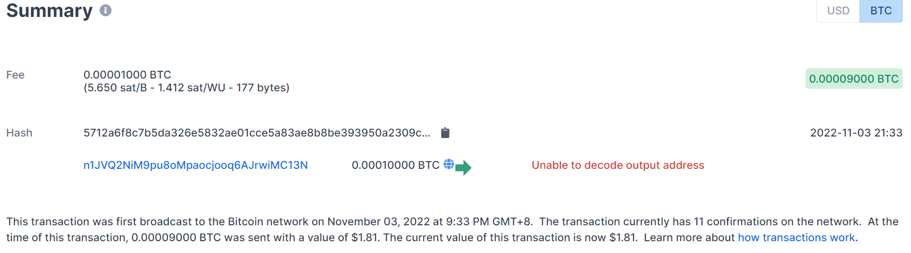
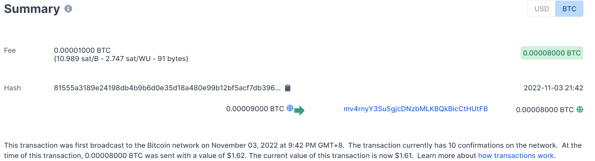

### <center>区块链实验报告</center>
 <p align="right">计算机科学与技术  &emsp;&emsp;  2012679王娇妹</p> 

 #### 关键代码
 我的学号是2012679，前四位2012，后三位678（调整最后一位保证奇偶性相同）。
X + Y = 2012
X - Y = 678
得：X = 1345， Y = 667

scriptSig 提供两个整数x、y，压入栈中。
  ```python
  # implement the scriptSig for redeeming the transaction created in Exercise 3a.
txin_scriptSig = [1345, 667]
  ```

 ```python
 # Complete the scriptPubKey implementation for Exercise 3
ex3a_txout_scriptPubKey = [OP_2DUP, OP_ADD, 2012, OP_EQUALVERIFY, OP_SUB, 678, OP_EQUAL]
  ```

* OP_2DUP
  因为要进行加、减两个运算，所以先使用OP_2DUP将x和y复制一遍
* OP_ADD
  将复制得到的x、y相加
* 2012
  我学号的前四位
* OP_EQUALVERIFY
  判断x + y是否等于2012
* OP_SUB
  计算x - y
* 678
  学号后三位，为了保持奇偶性相同，我将最后一位减1
* OP_EQUAL
  比较x - y是否与678相等，如果相等，则证明x和y是正确的解


 #### 控制台输出
 ##### ex3a.py的输出
  ```json
201 Created
{
  "tx": {
    "block_height": -1,
    "block_index": -1,
    "hash": "5712a6f8c7b5da326e5832ae01cce5a83ae8b8be393950a2309c58b7e77998ba",
    "addresses": [
      "n1JVQ2NiM9pu8oMpaocjooq6AJrwiMC13N"
    ],
    "total": 9000,
    "fees": 1000,
    "size": 177,
    "vsize": 177,
    "preference": "low",
    "relayed_by": "2001:250:401:6562:159e:ed3d:cf84:e76c",
    "received": "2022-11-03T13:33:35.784470756Z",
    "ver": 1,
    "double_spend": false,
    "vin_sz": 1,
    "vout_sz": 1,
    "confirmations": 0,
    "inputs": [
      {
        "prev_hash": "8e087aa8922a1c27e5623f47bffb679e93a83c9044a7771c3fb262769ade8333",
        "output_index": 2,
        "script": "4730440220291bd811e871652c6f1b030ae6512578b82f4425d3a39e224085ae9f9798806d022018b9122f7e152f1f64ed47fa13771d9453a599e6526eaa1317f4cd7a109b4609012103a9d4736d001d382bede6c181cd128734499485d769a51e217a33578b755e24a0",
        "output_value": 10000,
        "sequence": 4294967295,
        "addresses": [
          "n1JVQ2NiM9pu8oMpaocjooq6AJrwiMC13N"
        ],
        "script_type": "pay-to-pubkey-hash",
        "age": 2350573
      }
    ],
    "outputs": [
      {
        "value": 9000,
        "script": "6e9302dc07889402a60287",
        "addresses": null,
        "script_type": "unknown"
      }
    ]
  }
}
  ```
##### ex3b.py的输出
  ```json
  201 Created
{
  "tx": {
    "block_height": -1,
    "block_index": -1,
    "hash": "81555a3189e24198db4b9b6d0e35d18a480e99b12bf5acf7db39641531d7e187",
    "addresses": [
      "mv4rnyY3Su5gjcDNzbMLKBQkBicCtHUtFB"
    ],
    "total": 8000,
    "fees": 1000,
    "size": 91,
    "vsize": 91,
    "preference": "low",
    "relayed_by": "2001:250:401:6562:159e:ed3d:cf84:e76c",
    "received": "2022-11-03T13:42:48.3067036Z",
    "ver": 1,
    "double_spend": false,
    "vin_sz": 1,
    "vout_sz": 1,
    "confirmations": 0,
    "inputs": [
      {
        "prev_hash": "5712a6f8c7b5da326e5832ae01cce5a83ae8b8be393950a2309c58b7e77998ba",
        "output_index": 0,
        "script": "024105029b02",
        "output_value": 9000,
        "sequence": 4294967295,
        "script_type": "unknown",
        "age": 0
      }
    ],
    "outputs": [
      {
        "value": 8000,
        "script": "76a9149f9a7abd600c0caa03983a77c8c3df8e062cb2fa88ac",
        "addresses": [
          "mv4rnyY3Su5gjcDNzbMLKBQkBicCtHUtFB"
        ],
        "script_type": "pay-to-pubkey-hash"
      }
    ]
  }
}
  ```
 #### 交易截图
 ##### ex3a.py的截图
 
 ##### ex3b.py的截图
 

